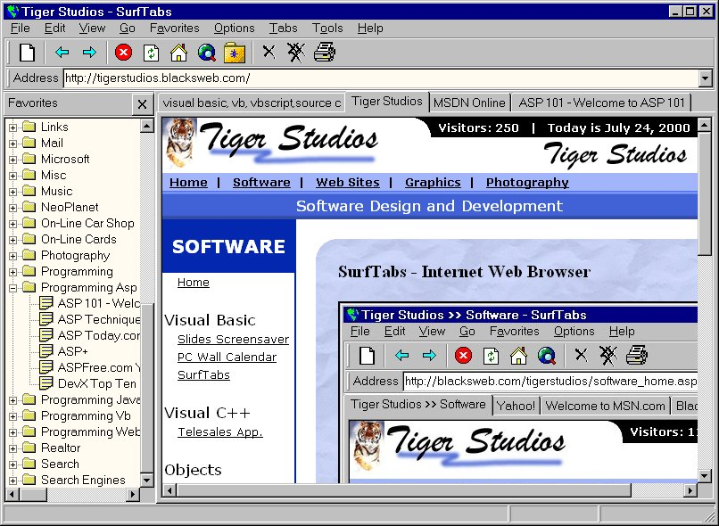



## SurfTabs \- New Version 1\.6\.13

### Description

SurfTabs, the open source web browser based on the Microsoft Internet Explorer object.

Enabled [backspace] in the URL address text box. Fixed History to prevent duplicate entries. Fixed History to save new entries with out the http://. Fixed Add To Favorites so it saves it as the site name instead of the URL. Also fixed a minor bug in the Favorites code, but did not yet fix the folder with in a folder problem. And a few other minor things.

This may be my last posting for SurfTabs here at Planet-Source-Code due to my new SurfTabs site at http://BlacksWeb.com/SurfTabs . There you can find news about SurfTabs, download the program and source code, post requests or bugs, and submit your own code for SurfTabs.
 
### More Info
 

             |
---                |---
**Submitted On**   |2000-08-17 13:26:18
**By**             |[Jim Black](https://github.com/Planet-Source-Code/PSCIndex/blob/master/ByAuthor/jim-black.md)
**Level**          |Advanced
**User Rating**    |4.9 (39 globes from 8 users)
**Compatibility**  |VB 6\.0
**Category**       |[Complete Applications](https://github.com/Planet-Source-Code/PSCIndex/blob/master/ByCategory/complete-applications__1-27.md)
**World**          |[Visual Basic](https://github.com/Planet-Source-Code/PSCIndex/blob/master/ByWorld/visual-basic.md)
**Archive File**   |[CODE\_UPLOAD90468172000\.zip](https://github.com/Planet-Source-Code/jim-black-surftabs-new-version-1-6-13__1-10759/archive/master.zip)

